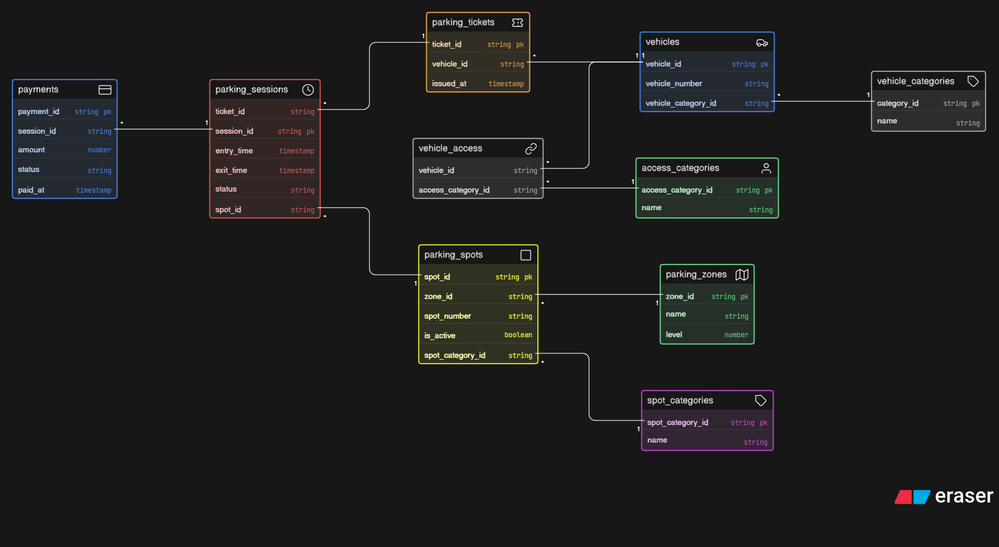

# Comic-Con Parking System – ER Diagram

## Overview

This project presents the ER diagram for a multi-zone parking system designed for a large-scale event like Comic-Con India.

The system manages vehicle entry, parking spot allocation, session tracking, reserved categories, and payments in a structured and scalable way.

---

## Core Entities

The system includes the following key entities:

* **Vehicle** → Stores vehicle details
* **VehicleCategory** → Defines types of vehicles (bike, car, SUV, EV)
* **ParkingZone** → Represents zones or levels in the venue
* **ParkingSpot** → Individual parking spaces
* **SpotCategory** → Reserved categories (VIP, staff, exhibitor, EV)
* **ParkingTicket** → Ticket issued when a vehicle enters
* **ParkingSession** → Tracks entry and exit of a vehicle
* **Payment** → Stores payment details for each parking session
* **AccessCategory** → Represents special access roles (VIP, staff, cosplayer, etc.)
* **VehicleAccess** → Maps vehicles to access categories

---

## 🔗 Relationships

* One vehicle can have multiple parking tickets over time
* Each ticket corresponds to one parking session
* One parking spot can be used across multiple sessions
* Each parking spot belongs to a zone
* Parking spots can have reserved categories
* Each parking session is linked to one payment
* Vehicles can have special access categories through a junction table

---

## ER Diagram

---

## 📁 Files

* `erd.png` → ER Diagram image
* `README.md` → Project documentation
